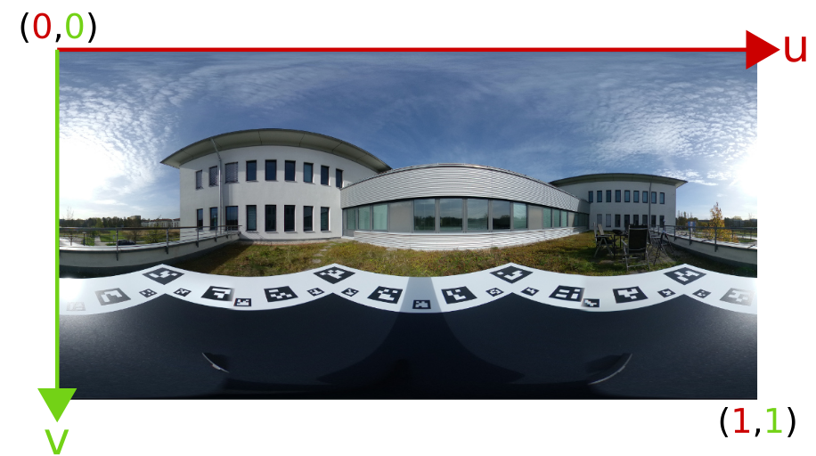
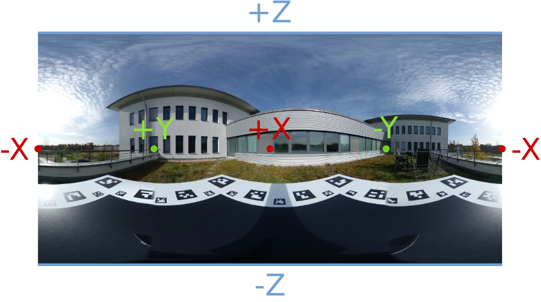
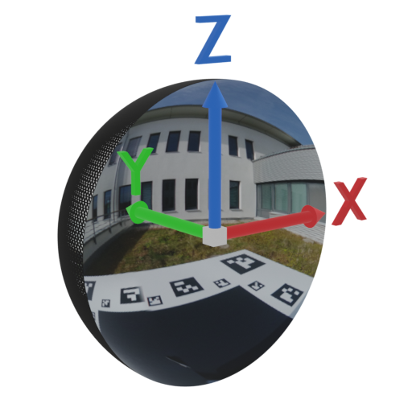

# Objects with Lighting

## [Paper](https://arxiv.org/abs/2401.09126)

This repo is the code distribution for the _Objects with Lighting_ dataset.
It contains the evaluation script (`scripts/evaluation.py`) and the tools used for building the dataset.

If you find the data or code useful please cite
```bibtex
@inproceedings{Ummenhofer2024OWL,
  author       = {Benjamin Ummenhofer and
                  Sanskar Agrawal and
                  Rene Sep{\'{u}}lveda and
                  Yixing Lao and
                  Kai Zhang and
                  Tianhang Cheng and
                  Stephan R. Richter and
                  Shenlong Wang and
                  Germ{\'{a}}n Ros},
  title        = {Objects With Lighting: {A} Real-World Dataset for Evaluating Reconstruction
                  and Rendering for Object Relighting},
  booktitle    = {3DV},
  publisher    = {{IEEE}},
  year         = {2024}
}
```

## Downloads

Please download the dataset from the current release or use the links below for the latest version. Extracting the files in the repository root will create the `dataset` directory.

- [objects-with-lighting-dataset-v1_1.tgz](https://github.com/isl-org/objects-with-lighting/releases/download/v1/objects-with-lighting-dataset-v1_1.tgz)
- [objects-with-lighting-dataset-v1_2.tgz](https://github.com/isl-org/objects-with-lighting/releases/download/v1/objects-with-lighting-dataset-v1_2.tgz)

```bash
wget https://github.com/isl-org/objects-with-lighting/releases/download/v1/objects-with-lighting-dataset-v1_{1,2}.tgz
```

## Directory structure

```
├─ calibration      # Data files for calibration and generated calibration parameters
├─ dataset          # Contains the data meant for consumption
├─ docs             # Images and markdown for documentation
├─ methods          # Documentation and scripts for the baseline method and other state-of-the-art methods
├─ scripts          # This dir contains scripts for creating data and evaluation
├─ utils            # Utility python modules used by all scripts
```

## Evaluation script

The script `scripts/evaluate.py` can be used to compute the common metrics PSNR, SSIM, LPIPS for predicted images.
The results will be stored in a json file.
 - Supported image file formats are `.png`, `.exr`, and `.npy`.
 - We assume `.exr` and `.npy` files store unclipped linear images, while `.png` stores values after applying the tonemapping as used for the dataset.
 - For linear images the evaluation script computes the optimal exposure value minimizing the least squares error before computing the error metrics.
 - The predicted images have to be stored with the same folder structure as the dataset and should be named `pr_image_xxxx.{npy,exr,png}`.

The script can be invoked as 
```bash
python scripts/evaluate.py -p path/to/predictions results.json
```

## Dataset format

```
├─ dataset
    ├─ object_name     # The dataset is grouped into objects 
        ├─ test        # Files in the test dir are meant for evaluation
            ├─ inputs  # The inputs dir contains all files that are allowed to be used by the methods
```

Each of the test directories contains the following data.

| File | Description |
| --- | --- |
| `inputs/`  | This directory contains all data for reconstructing the object. For a fair evaluation only data inside this folder may be used. |
| `inputs/image_xxxx.png`  | Image files with 8-bit RGB images after tonemapping. |
| `inputs/camera_xxxx.txt` | Camera parameters for the corresponding image file. |
| `inputs/mask_xxxx.png` | An approximate mask for methods that require it. |
| `inputs/exposure.txt`    | The exposure value that has been used in the tonemapping. |
| `inputs/object_bounding_box.txt`  | The axis aligned bounding box of the object. This box is not a tight bounding box. |
| `env.hdr`    | An equirectangular image of the environment where the input images have been taken. This image is provided for debugging purposes and should not be used for reconstruction or evaluation. |
| `env_512_rotated.hdr` | This environment map is downscaled to 1024x512 and has been rotated with the 'world_to_env' transform for easier usage. This image is provided for debugging purposes and should not be used for reconstruction or evaluation. |
| `world_to_env.txt` | The 4x4 world to camera transform that transforms a point into the coordinate system of the equirectangular image 'env.hdr'. |
| `gt_image_xxxx.png` | A ground truth image used in evaluation. |
| `gt_camera_xxxx.txt` | The corresponding camera parameters for a ground truth image. |
| `gt_mask_xxxx.png` | The mask used for evaluation. Valid pixels are marked with the value 255. |
| `gt_exposure_xxxx.txt` | The exposure used in the tonemapping of the corresponding ground truth image. |
| `gt_env_xxxx.hdr` | An equirectangular image of the environment where the corresponding ground truth image was taken. |
| `gt_world_to_env_xxxx.txt` | The 4x4 world to camera transform that transforms a point into the coordinate system of the equirectangular image 'gt_env_xxxx.hdr'. |
| `gt_env_512_rotated_xxxx.hdr` | This environment map is downscaled to 1024x512 and has been rotated with the 'world_to_env' transform for easier usage. |

### Tone mapping

We generate the tonemapped 8-bit images with the following function.

$$ y = 255 (x 2^\text{exposure})^\gamma $$

We use $\gamma=1/2.2$ for all images in the dataset.
The exposure values used may differ for input and test images. The exposure values can be found in the corresponding `exposure.txt` files.
The values $y$ are clipped to the range 0 to 255.

### `.txt` files

#### Camera parameters
The camera parameters are defined by the intrinsic matrix $K$, and the extrinsics $R,t$.
We can project a 3D point $X$ to the camera coordinate system with 

$$ x = K(R X + t) $$

Note that $x$ is in homogeneous coordinates.
The camera parameters are stored in the `*camera_xxx.txt` files in the following format.
```
k11 k12 k13
k21 k22 k23
k31 k32 k33
r11 r12 r13
r21 r22 r23
r31 r32 r33
tx  ty  tz
width height channels
```

The following snippet can be used to parse the file with numpy.
```python
params = np.loadtxt('path/to/camera_xxxx.txt')
K, R, t, (width, height, channels) = params[:3], params[3:6], params[6], params[7].astype(int)
```

#### Object bounding box
The `object_bounding_box.txt` files describe an axis aligned bounding box.
The format used in the text file is
```
xmin xmax ymin ymax zmin zmax
```

#### World to environment map transforms
The `*world_to_env*.txt` files describe a transformation from the world coordinate system into the coordinate system of the omnidirectional camera that captures the environment.
The text file stores a 4x4 transformation matrix and transforms a homogeneous 3D point to the camera coordinate system.
Usually we make the assumption that the environment is infinitely far away from the object and we are only interested in directions.
In this case we only the rotational part of the 4x4 matrix in the upper left corner is of interest.
With $R$ as the rotation and $t$ as the translation the format of the text file is
```
r11 r12 r13 tx
r21 r22 r23 ty
r31 r32 r33 tz
0   0   0   1
```

#### Exposure
The exposure values are single scalars stored in the `*exposure*.txt` files.

## Coordinate systems

The dataset uses right-handed coordinate systems.

### Cameras
Cameras look in positive z-direction.
The intrinsic and extrinsic camera parameters can be used to directly project a 3D point $X$ to image space coordinates.

$$ x = K(R X + t) $$

$x$ is a homogeneous point describing a position in the image.


### Images
The x-axis for images points to the right and the y-axis points down following the memory order.
The coordinates $(x,y)$ of the top left corner are $(0,0)$.
The center of the first pixel is at $(0.5, 0,5)$.
The bottom right corner for an image with witdth $w$ and height $h$ is at $(w, h)$.


### Environment maps
Environment maps are stored as equirectangular images. 
We use a normalized coordinate system similar to regular images.
The u-axis points to the right and the v-axis points down following the memory order.
The coordinates $(u,v)$ of the top left corner are $(0,0)$.
The bottom right corner is at $(1, 1)$ irrespective of the size of the environment map.
This corresponds to the texture coordinate convention used by DirectX.



Directions map to the equirectangular image as shown in the image below.
The direction +Z $(0,0,1)$ maps to the upper border of the environment map and -Z $(0,0,-1)$ to the lower border.
+X $(1,0,0)$ maps to the center and -X $(-1,0,0)$ maps to the vertically centered point on the right and left border.
+Y $(0,1,0)$ and -Y $(0,-1,0)$ map to the uv coordinates $(0.25,0.5)$ and $(0.75,0.5)$ respectively.



The following shows the left half of the environment map mapped to a sphere.



